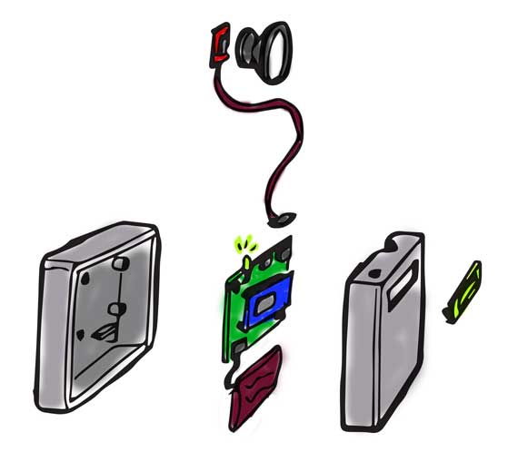

ABDOMINAL AUDITORY MONITOR
============

**University of Pennsylvania, ESE 519: Real Time and Embedded Systems**

* Jono Sanders, Hitali Sheth, Sindhu Honnali
* [Blog on Devpost](https://devpost.com/software/abdominal-auditory-monitor-h0qpsu)

### DESCRIPTION AND GOALS
Create a low cost device to observe a patient after an operation on the stomach and detect bowel activity so that they can resume eating.
Goals:
1. Use external sensor to detect/filter sounds
2. Define criteria for different kinds of sound expected
3. Train microcontroller to detect
4. Visualize on Tablet
[5. Add additional sensors to detection contact with skin, motion, and bandage tightness]

### VIDEO
Coming soon

### IMAGES and GIFs
[]

### BUILD INSTRUCTIONS
TODO: Steps to follow for anyone to use this code
