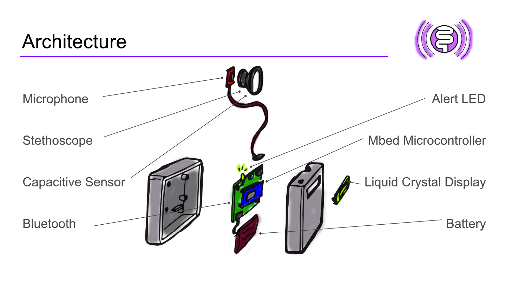

### REAL TIME EMBEDDED SYSTEMS PROJECT
============

**University of Pennsylvania, ESE 519**

**Team**: Jono Sanders, Hitali Sheth, Sindhu Honnali

**Blog**: [Abdominal Auditory Monitor on Devpost](https://devpost.com/software/abdominal-auditory-monitor-h0qpsu)

### DESCRIPTION AND GOALS

**Description**:

This device observes a patient after an abdominal operation to detect bowel activity so that they can resume eating.

**Goals**:

1. Use external sensor to detect/filter sounds

2. Define criteria for different kinds of sound expected

3. Train microcontroller to detect

4. Visualize on Tablet

5. Add additional sensors to detection contact with skin, motion, and bandage tightness [STRETCH GOAL]

### UPDATES and VIDEO

Find updates at [Abdominal Auditory Monitor on Devpost](https://devpost.com/software/abdominal-auditory-monitor-h0qpsu)

Video coming soon

### IMAGES and GIFs

### BUILD INSTRUCTIONS
TODO: Steps to follow for anyone to use this code
